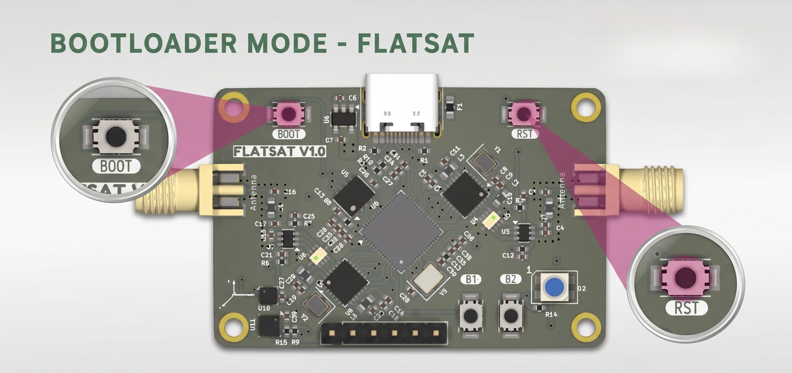

# FlatSat Firmware: Getting Started, Compilation & Testing

This comprehensive guide covers the end-to-end process of setting up, flashing, and validating your FlatSat environment. Whether you want to quickly flash a pre-compiled release or compile everything from source across different operating systems, follow the steps below.

---

## Method 1: Quick Start - Flashing Pre-Compiled Firmware

If you do not need to modify the source code and want to get your FlatSat board running immediately, you can flash the pre-compiled production binary.

### 1. Download the Firmware Binary
Download the latest `.uf2` file from our repository releases page:
* **Production Firmware URL:** `https://github.com/Pwnsat/FlatSat/releases` (Locate and download `flatsat-firmware.uf2`)

### 2. Hardware Flashing Sequence (Physical Button Method)
The FlatSat board features an on-board USB Mass Storage bootloader hardcoded into the RP2040 chip. You do not need external hardware debuggers to write the firmware.

Follow this exact tactile switch sequence:

1. **Download** the `flatsat-firmware.uf2` file from the release page.
2. Put the board into bootloader mode: **Unplug** the device.
3. **Press and hold** the **BOOT** button.
4. While holding the button, **plug the device back in** to your computer.
5. **Release** the **BOOT** button.
6. **Drag and drop** the `flatsat-firmware.uf2` file onto the removable device labeled **RPI-RP2**.

```text
[STEP 2 & 3]                                [STEP 4 & 5]
   +-----------------+                         +--------------------+
   |   BOOT BUTTON   |                         | USB TYPE-C CABLE   |
   +-----------------+                         +--------------------+
            |                                            |
            v                                            v
     Keep Pressed --------------------------------> Plug Device Back In
                                                         |
  [STEP 5: RELEASE]                                      v
  Release BOOT Button                                Board Mounts As
                                                      'RPI-RP2' Drive!

```


* **Full Changelog:** https://github.com/Pwnsat/FlatSat/releases/tag/v1.0.0

### 3. Deploying the File

1. Your operating system will instantly detect the device as a standard USB thumb drive volume named RPI-RP2.
2. Drag and drop or copy the downloaded flatsat-firmware.uf2 file directly into the root directory of the mounted RPI-RP2 drive.
3. As soon as the transfer completes, the FlatSat hardware will automatically unmount, flash its internal memory, reset, and immediately begin running the satellite flight software.


## Method 2: Advanced Start - Compiling & Flashing via Arduino IDE
If you want to modify, compile, and upload the source code manually, follow these standard Arduino IDE instructions tailored for Windows, macOS, and Linux.

### 1. IDE Setup & Board Manager Installation
1. Download and install the latest Arduino IDE (v2.x or higher).
2. Open Arduino IDE and navigate to File -> Preferences (or Arduino IDE -> Settings on macOS).
3. Click OK.
4. Go to the left sidebar, click on the Boards Manager icon, search for Raspberry Pi Pico/RP2040, and click Install.

### 2. Clone the Repository
1. Open your terminal or command prompt and clone the workspace recursively to include all underlying aerospace submodules:
```Bash
git clone --recursive https://github.com/Pwnsat/FlatSat.git
```
### 3. OS-Specific Prerequisites & Configurations

Windows: Port Detection: Ensure you have the official Raspberry Pi drivers installed (automatically bundled with the Arduino Pico core).
```Bash
Target Configurations: In Arduino IDE, go to Tools -> Board -> Raspberry Pi Pico/RP2040 and select Raspberry Pi Pico.
```
MacOS Permissions: macOS might require security authorization for compilation toolchains. If prompted with a developer verification block under System Settings -> Privacy & Security, click Allow Anyway.
```Bash
Target Configurations: Select Raspberry Pi Pico under the RP2040 boards menu.
```
Linux (Debian / Ubuntu / Kali) Dialout Permissions: To read and write to USB serial ports without root permissions, add your user to the dialout group:

```Bash
sudo usermod -aG dialout $USER
(Log out and log back in for changes to take effect).
```

### 4. Compilation & Upload Pipeline
1. In Arduino IDE, open the primary sketch file: Firmware/firmware.ino.
2. Connect your FlatSat hardware using the Physical Button Method described in Part 1 to ensure it's in bootloader mode (RPI-RP2 visible).
3. Select your board configuration from Tools -> Board -> Raspberry Pi Pico.
4. Click the Upload button (the arrow icon in the top left corner).
5. Arduino IDE will compile the code from source, automatically target the dual-core memory mapping, and flash the hardware over the virtual serial port.


### 5. Local Hardware Sanity Verification
Before conducting radio over-the-air tests, confirm that the system is booting successfully by monitoring the isolated debug data stream managed entirely by Core 1 over the USB interface.

1. Open your terminal and connect to the emulated USB Serial Line interface at a baud rate configuration of 115200:

From a macOS Terminal:

```Bash
screen /dev/tty.usbmodem* 115200
(To exit the screen session in Mac, press Ctrl + A followed immediately by Ctrl + \).
```

From a Linux Terminal:

```Bash
minicom -D /dev/ttyACM0 -b 115200
```

2. Expected Output Logs: Upon connection, you should witness automated diagnostic outputs tracking system execution tasks:

```Bash
[INFO] USB Device configured successfully
[INFO] ACC OK
[INFO] BME OK
[INFO] Radio 0 Configured Successfully!
[INFO] Radio 1 Configured Successfully!
[TM - SPP] APID=0x008 SEQ=1 LEN=20 FLAGS=3 SEC_HDR=NO
[TM - SPP] APID=0x001 SEQ=2 LEN=8 FLAGS=3 SEC_HDR=NO
[TM - SPP] APID=0x3FF SEQ=0 LEN=14 FLAGS=3 SEC_HDR=NO
```

If you see these telemetry outputs updating regularly, your processing hardware, primary sensor buses, and operating software runtime are completely functional.


## Time to Test: RF Telemetry Interception & Verification

FlatSat acts as a live, functional satellite simulator broadcasting true CCSDS packets into local airspace using sub-GHz radio modulations. You can physically confirm over-the-air operations using passive and analytical Software Defined Radios (SDR).

---

### Local Hardware Sanity Check

Before performing radio tests, ensure the board is running properly by opening the Serial Monitor in Arduino IDE (configured to 115200 baud). You should see automated diagnostic outputs tracking system execution tasks:

* Active core initialization messages checking both Core 0 and Core 1.
* Periodic telemetry cycles triggering updates every 10.5 seconds.
* Hardware status confirmations showing that the SX1262 radio modules have booted successfully.

---

### Over-the-Air Interception Flow

To verify that the firmware is successfully broadcasting over the air without relying on local cables, you can passively intercept the raw radio signal using an RTL-SDR dongle and the SDR++ software framework.

### Drivers and Tooling

To operate with RTL-SDR in Parrot Linux, the hardware abstraction layer must be correctly configured. Upon initialization, the FlatSat system boots its core sensors, including the BME280 (atmospheric data) and LIS2DH12 (inertial data), while initializing the Radio Uplink/Downlink channels.

---

#### 1. Hardware Driver Installation

First, install the low-level drivers to allow the operating system to communicate with the RTL-SDR hardware:

```bash
sudo apt install rtl-sdr
```

#### 2. Hardware Setup and Connection

1. Insert your **RTL-SDR** device into a high-speed USB port on your workstation.
2. Connect a suitable Sub-GHz antenna tuned to your regional ISM band 916 MHz into the SDR's SMA connector to maximize signal reception.
3. Power up the FlatSat board to allow Core 0 to start broadcasting the non-blocking telemetry frames.


#### 3. SDR++ Software Configuration

For high-fidelity visual analysis and real-time tuning of radio bands, we utilize SDR++. It provides the necessary waterfall clarity required to identify the distinct LoRa chirps and signal boundaries sent by the satellite. You can acquire the software framework directly from the official repository:

*  Official Distribution: https://www.sdrpp.org/

#### 4. Spectrum Enumeration and Discovery

Since the exact operating frequency of the target might be unconfirmed during initial deployment, we employ a spectral density scanning technique to systematically cover the range from 1 MHz to 999 MHz. This allows us to locate the satellite’s signal footprint among the noise floor without prior intelligence.

* Step 1: Power Scanning via Command Line

The rtl_power utility is the most efficient tool for this task because it operates without a Graphical User Interface (GUI), focusing all system resources on raw sampling, listening, and logging performance data.

Execute the following scan command in your terminal:

```bash
rtl_power -f 1M:999M:1M -i 5s -g 45 pwnsat_recon.csv
```

#### 5. Parameter Breakdown:

* -f 1M:999M:1M: Scans the radio spectrum from 1 MHz to 999 MHz in precise 1 MHz bins.
* -i 5s: Integrates signal energy for 5 seconds at each frequency step, which is mathematically sufficient to capture FlatSat’s intermittent telemetry bursts.
* -g 45: Sets a high hardware gain (44.5 dB verified) to ensure detection of distant, weak, or attenuated signals.
* pwnsat_recon.csv: The target comma-separated output file where all received energy peaks are recorded.

Operational Constraint: Let the scan run for at least 15–20 minutes. Satellite telemetry is transmitted in non-blocking intervals; cutting the scan session too short will result in missing critical transmission bursts.

#### Raw Data Analysis (Frequency Identification)
The resulting pwnsat_recon.csv file contains all numerical power measurements over the scanned spectrum. To accurately identify the target satellite frequency, we sort the raw data rows to find the highest energy peaks rather than attempting to render a heavy heatmap matrix manually.

Run this command sequence in your terminal:

```bash
sort -t, -k7 -n /home/r0r0x/Desktop/Research/Labs/pwnsat_recon.csv | tail -n 30
```

#### Expected Analytical Results:

Processing the output power logs reveals significant energy spikes that stand out sharply against the background noise floor:

* Identified Frequency Range: The sort command shows constant, high-power activity in the 28 MHz band (specifically between 28,000,000 Hz and 29,000,000 Hz), with recorded power levels exceeding 22.14 dB.

* Secondary Detection: A sharp, distinct peak is observed precisely in the 915 MHz band (916,000,000 Hz) tracking a power level of 20.65 dB.

Given that the 916 MHz band is a standard international band for LoRa and ISM communications, this frequency becomes our primary candidate for fine-tuning and active interception.

#### Fine-Tuning with SDR++

Now that the spectral trail has been mathematically identified via logs, open the SDR++ interface to visually confirm the signal’s modulation characteristics. This phase transforms raw data points into actionable visual intelligence before moving to the extraction phase.

#### Configuration Workflow:

*  Source Selection: Open the source selector panel on the top-left area and choose your attached hardware backend (RTL-SDR or HackRF).
* Target Frequency: Navigate directly to the suspicious frequency identified in the logging phase: 916.000.000 MHz.
* Visualization: In the Appearance tab, enable the Max Hold processing function to capture the peak envelope of the intermittent bursts.
* Verification: Look for block-shaped spectral peaks characteristic of spread-spectrum LoRa modulation.

#### Waterfall and Spectrum Verification Results

The real-time visual output confirms a hard lock on the satellite’s downlink transmission parameters:


*  Signal Quality: The waterfall background displays as dark blue, indicating a controlled and stable noise floor. Data bursts display as bright white/yellow horizontal markers that are sharp, distinct, and well-defined.
*  Burst Structure: Three clear horizontal bursts are clearly visible in the center of the waterfall panel. The sharpness of these power lines confirms a strong, clean signal free from significant multi-path interference.
*  This visual confirmation validates that the onboard firmware is successfully running its non-blocking telemetry worker routines, mapping spatial metrics, and emitting physical radio signals into the environment. The system is now fully prepared for downstream protocol parsing or telecommand injection auditing.

